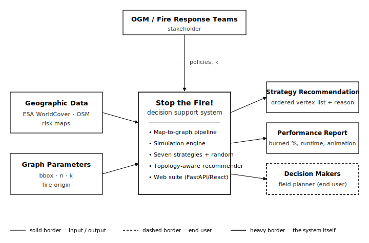

# Stop the Fire!
## A Network Optimization Approach to Wildfire Containment in the Köyceğiz–Marmaris Region

**IE 492 — Senior Design Project · Final Report**
**Department of Industrial Engineering, Boğaziçi University**
**May 2026**

**Team**
Efe Ergen (2021402168)
Emre Barutçu (2023402219)
Mehmet Efe Aloğlu (2020402024)
Kerem Külünkoğlu (2023402222)

**Supervisor**
Prof. Tınaz Ekim

---

## Abstract

Wildfires in the eastern Mediterranean have become more frequent and more destructive over the past decade, and the Turkish forestry agency (OGM) still relies on a largely reactive operational doctrine: detect a fire, dispatch ground crews, and try to suppress the flame front after it has already started to expand. This project builds a proactive, graph-theoretic decision support tool that recommends *which* parts of a real forest landscape a small number of intervention units should defend first, before the front reaches them. We model the landscape as a planar graph extracted from satellite land-cover data and open street/river maps, simulate fire propagation as a discrete deterministic process on this graph, and compare seven principled containment strategies plus a random baseline against each other on 4,752 controlled synthetic runs and a real Köyceğiz–Marmaris case study. The strategies fall under three philosophies: local greedy heuristics (which protect the vertex that looks best right now), global structural heuristics (which look for natural bottlenecks in the graph), and a one-step lookahead policy (which simulates the engine inside its own decision-making). On a 4,752-run synthetic Delaunay benchmark, the one-step lookahead policy burns 27.5% of the network on average versus 70.1% for random selection, a 43-point gap, while running in roughly 2 ms per turn. On the real Köyceğiz map (101 vertices, 50,280 ha of forest, 172 active edges, k = 2 firefighters per turn), the same policy contains the fire to 16.8% of the network. The full pipeline is wrapped in a web application (FastAPI backend, React/Leaflet frontend) that lets a forestry planner draw a bounding box on a map, build the corresponding graph in roughly a second, pick a fire origin, and read off an ordered list of vertices to defend, together with a recommendation card explaining why a particular strategy was chosen for the topology in question.

**Keywords:** Firefighter Problem, wildfire containment, network optimization, planar graphs, min-cut, lookahead heuristics, decision support, GIS, ESA WorldCover.

---

## 1. Introduction

### 1.1 The industrial engineering problem

Containing a wildfire is, at its core, a sequential decision problem under tight resource constraints. The fire spreads in time, intervention units are scarce, and at every operational step the planner has to decide which patches of forest to defend first so that the *total* damaged area at the end of the campaign is as small as possible. The question is not how to put a fire out: once the canopy is burning, restoration is on the order of decades, so the only productive lever is *prevention of spread*. That reframing turns a physical phenomenon into a graph-theoretic optimization problem with a clear objective function (total burned vertices), a hard constraint (k vertices defended per turn), and a non-trivial combinatorial structure (the same k units placed at different points yield very different total damage depending on the topology of the surrounding network).

This is the *Firefighter Problem*, introduced by Hartnell in 1995 and known to be NP-hard on general graphs, NP-hard even on trees of bounded degree, and still APX-hard on planar graphs of maximum degree four. The Firefighter Problem is therefore exactly the kind of question industrial engineering tools are designed for: a polynomial-time exact solution is out of reach, but well-chosen heuristics and structural insights can move the burned fraction by tens of percentage points. Our project takes this framework, adapts it to a real Turkish landscape (Köyceğiz–Marmaris), and packages the resulting heuristics into a decision-support tool that a forestry planner can actually use.

### 1.2 Identification, analysis, and solution methodology in brief

Identification began with the observation that OGM operations are reactive in nature: the planning lever today is which crew to dispatch to a known fire, not which corridor to defend before the fire arrives. We confirmed the gap with our supervisor and chose the Mediterranean forestry belt (Köyceğiz, Toros Batı, Marmaris) as the concrete pilot region.

Analysis proceeded in three parallel tracks. First, a literature review of the Firefighter Problem and its planar variants, which gave us the baseline heuristics. Second, the construction of a deterministic simulation engine that mirrors the protect-then-spread mechanics of the formal model. Third, a map-to-graph pipeline that converts ESA WorldCover satellite tiles and OpenStreetMap (OSM) settlement/river data into a planar graph whose vertices are forest patches and whose edges are physically traversable adjacencies after natural barriers (water, bare strips, settlements) are removed.

The solution methodology is a controlled comparison of seven strategies plus a random baseline on 4,752 synthetic instances followed by a single real-map case study. Strategies are grouped into three philosophies, and the best representative in each is highlighted in the recommendation engine. The output is a recommended order in which the planner should defend vertices.

### 1.3 Expected improvements

Relative to the random baseline (which mimics what an uninformed dispatcher would do), the best strategy reduces average burned fraction from 70.1% to 27.5% across synthetic instances, a 60% relative improvement. Relative to the simplest informed heuristic (max-degree, a natural first thought for a forestry planner), the same strategy reduces the burned fraction from 42.4% to 27.5%, a 35% relative improvement. On the Köyceğiz real-map case the improvement over random is 31.7% → 16.8% (a 47% relative cut). These numbers are not the realistic field expectation, because the model is deterministic and ignores wind; they should be read as relative ordering evidence, not absolute promises.

### 1.4 Brief summary of conclusions

The most robust finding across all our experiments is that no strategy dominates on every topology, but the ordering between strategies is consistent enough that a topology-aware recommendation engine is worth building. Within that ranking, the one-step lookahead policy — which simulates the engine's own two-turn behaviour inside the decision — wins on both the synthetic benchmark and the Köyceğiz real-map case, at a cost per decision under 3 ms even on the real graph. A second, narrower result is that reformulating the structural family from "minimise the cost of an arbitrary cut" to "maximise saved-per-cost ratio across multiple candidate cuts" produced a 23% relative reduction in burned fraction (39.4% → 30.3%) against the Vertex Front baseline it replaced. We credit that reformulation directly to the design feedback received from our supervisor on 14 April.

### 1.5 Contents of the report

Section 2 frames the problem and lists requirements, assumptions and constraints, including the data we gathered for identification and a context diagram. Section 3 reviews the relevant literature, alternative solution approaches, and the methods we eventually chose. Section 4 develops the seven strategies in detail. Section 5 compares them numerically and proposes the recommendation engine. Section 6 covers implementation, integration, and revision cadence. Section 7 closes with the IE tools and methods used, the merits and significance of the design, and a discussion of economic, environmental, and ethical impacts. The References list and Appendices A–C (test configuration, strategy code map, API endpoints) close the report.

---

## 2. Problem Definition, Requirements and Limitations

### 2.1 What seems to be the problem

The pilot stakeholder is OGM, the Turkish General Directorate of Forestry. Once a fire is reported in a forested district, the operational decision is which patches the available teams should drive to first. The current doctrine is essentially reactive: teams move toward the visible front and try to slow it. There is no analytical layer that says, *given* the topology of the local forest, the village locations and the natural barriers, *defend these two vertices in the next hour and these other two an hour later*. The question we tackle is to build that analytical layer.

Two structural facts make the problem hard. The underlying combinatorial problem (Firefighter on a planar graph) is NP-hard, so an exact optimum cannot be computed on the field timescale, and the resource constraint is binding: typical operational reports suggest two ground teams effectively allocatable to a single front, which we modelled as k = 2 vertices protected per turn. A third complication is geometric rather than combinatorial: Mediterranean forests are genuinely long-thin in some places (narrow valley forests along the Köyceğiz lake) and blob-like in others (continuous canopies on the Toros foothills), and the right intervention strategy is not the same in those two regimes.

### 2.2 What was done to understand the causes

The first three weeks of the project went into understanding *which* features of the problem matter most. The 03.03.2026 meeting established that vertex count, density, and connectivity together drive difficulty levels (low-density narrow corridors are paradoxically easier to defend than high-density blob forests, because the cuts are smaller). The 10.03.2026 meeting compared three graph-generation paradigms and ruled out Erdős–Rényi graphs because their diameter is too small to mimic forest spread realistically; we settled on planar graphs (Delaunay triangulation with edge filters) for synthetic experimentation and on a map-derived planar graph for the real case. The 24.03.2026 meeting refined the vertex-definition rule (vertices represent forest patches and intervention points; lakes and mountains are excluded; edges are dropped where a road, river or bare strip blocks fire transfer). The 14.04.2026 meeting produced the design pivot: the original min-cut strategy was minimising *cut cost*, not *burned vertices*, and a saved/cost ratio reformulation was needed.

We also looked at the operational data that is publicly available. ESA WorldCover (the European Space Agency's 10 m global land-cover product) gives a forest/shrub/grass/cropland/water/built-up classification of every 10 × 10 m pixel in Europe and is licensed permissively for non-commercial work. OpenStreetMap supplies village outlines, river polygons, and roads via the Overpass API. Together they specify, to within a hundred metres, where the forest is, where it is interrupted, and which natural barriers are available. For regional context, the EFFIS annual fire-statistics report for Europe, the Middle East and North Africa and the climate-driven drought analyses of Turco et al. (2017) confirm that the Mediterranean rim is in the highest severity band.

### 2.3 Needs and requirements of the system / customer

| ID | Need | Why it matters |
|----|------|----------------|
| R1 | Real geography input | The tool must accept a bounding box and produce a graph from the actual landscape, not a stylised abstraction. |
| R2 | Sub-second graph build (cached) | Field use requires that the planner can iterate on bbox/fire origin without losing flow. |
| R3 | Multiple, comparable strategies | Different topologies favour different heuristics; the planner needs to see the comparison and pick. |
| R4 | Per-turn animation | A static "burn percentage" does not communicate *where* the fire goes; the planner needs the trace. |
| R5 | Recommendation card | The planner is not an OR expert; the tool must explain *why* a strategy is suggested for the current case. |
| R6 | Reproducibility | Deterministic engine so two planners running the same scenario get the same answer. |
| R7 | Offline operation after first call | Field connectivity is unreliable; tile and Overpass responses are cached on disk. |

### 2.4 Limitations and constraints

**Operational.** The intervention budget k is small (k = 2 in baseline, slider 1–6 in the demo). Protected vertices are immune for the rest of the campaign; once a vertex is burnt, it stays burnt. Time progresses in discrete one-hour steps; within a single step the planner protects k vertices, then the fire spreads simultaneously to every white neighbour of any red vertex.

**Modelling.** Vertex states are ternary (white, red, green) with no partial damage. Fire spread is deterministic in the baseline: there is no wind, no slope, no fuel-moisture variability. Network topology is static through a campaign; the planner cannot add or remove edges mid-fire.

**Computational.** The Firefighter Problem is NP-hard on planar graphs. The min-cut family of strategies relies on repeated max-flow computations whose cost scales with the number of vertices; on graphs of more than a few hundred vertices the per-turn cost becomes the binding constraint. We compensated by capping the synthetic graph sizes (n = 30, 50, 100) and by giving the recommendation engine the option to skip the heaviest strategies when k is small.

**Environmental, social, legal, ethical.** ESA WorldCover is freely usable for research; OpenStreetMap is ODbL-licensed and we credit it in the README and the live demo. We deliberately did not encode population density or settlement-protection priorities into the strategy scores at this stage, because that would require ethical input from OGM about how to value different kinds of asset (a village versus a forest hectare). The recommendation engine therefore stays at the level of *minimising forest hectares burned*; weighting by settlement priority is a flagged future extension.

**Geopolitical.** All data used is global open-data; the pilot region (Köyceğiz–Marmaris) is on Turkish territory. There is no cross-border data transfer.

### 2.5 Data gathered and used in the identification phase

* **Köyceğiz–Marmaris bounding box.** N 37.10, S 36.87, E 28.66, W 28.40. Area 589 km².
* **ESA WorldCover 2021 v200.** 10-m resolution land-cover raster; classes 10 (forest) and 20 (shrubland) together produced 50,280 ha of qualifying forest within the bbox.
* **OpenStreetMap Overpass extract.** All `natural=water`, `waterway=river`, and `place=village|town` features inside the bbox. 27 settlements were identified, including Ula, Köyceğiz, Kızılyaka, Marmaris and 23 smaller villages.
* **Synthetic generators.** Delaunay triangulations of uniform random points, long-thin Delaunay (aspect 6 × 1, motivated by the 14 April critique), hexagonal lattices, and Delaunay with 18% random edge removal to mimic obstacles. Used for 4,752 simulations across 3 sizes × 18 seeds × 11 starting points × 8 strategies.
* **Wildfire context.** Annual Turkish wildfire bulletins from OGM, EFFIS (European Forest Fire Information System) seasonal reports, and Lloyd's regional risk map were consulted to confirm that the pilot region is in the top severity band.

### 2.6 Context diagram

A systemic view of the design problem is given in Figure 1. The system sits between the planner and the data sources: it consumes geographic inputs and configuration parameters from the left, accepts policy and budget constraints from the stakeholder at the top, and produces three flows on the right — a strategy recommendation with a one-line justification, a quantitative performance report, and (through these) operational guidance to the human planner who remains the decision maker.

{width=100%}

### 2.7 Performance criteria and potential improvements

The primary criterion is the *burned fraction* at the end of a simulation: the number of red vertices divided by the total number of vertices. Secondary criteria are runtime per turn (we want the recommendation to come back in under a second on a laptop), variance across starting points on the same graph (a strategy that is brilliant on average but disastrous on a quarter of starting points is operationally worse than one that is consistently mediocre), and explainability (the recommendation must be one line of plain language).

Potential improvements identified during identification, in approximately decreasing order of expected impact:
1. **Stochastic spread (wind, slope, fuel moisture).** Will turn deterministic simulations into Monte-Carlo distributions; will change which strategies dominate in marginal cases.
2. **Settlement-priority weighting.** Currently all forest vertices have equal value; weighting vertices near villages would shift the recommendation toward protecting settlement buffers first.
3. **Multi-period budget (carry-over k).** Today's unused intervention capacity vanishes; in the field unused capacity can sometimes be redeployed the next hour.
4. **Live integration with OGM's fire-detection feed.** Today the fire origin is a click; in production it would come from the agency's detection layer.

---

## 3. Analysis for Solution / Design Methodology

### 3.1 Literature overview

The starting point of the literature is Hartnell's 1995 introduction of the Firefighter Problem at the 25th Manitoba Conference on Combinatorics. A fire breaks out at a vertex of a graph; at each step a firefighter protects up to k vertices, then the fire spreads to all unprotected neighbours of burning vertices. The goal is to minimise the number of burned vertices. Finbow and MacGillivray (2009) catalogue the early structural results: on infinite grids the problem becomes a tractable shape-design question; on trees with maximum degree three it is already NP-hard. Cai, Cheng, Verbin and Zhou (2010) give a tight 2-approximation for trees and an *e/(e − 1)*-approximation for the general problem under certain assumptions. On planar graphs of maximum degree at most four, the problem is APX-hard (King and MacGillivray, 2010), which closes the door on a polynomial-time exact algorithm for our setting.

Approximation and heuristic work then splits into two families. The *local greedy* family (max-degree, max-white-neighbours, save-the-most-savable) makes a single-step decision from a local feature of the fire front. The *structural* family treats the spread as a flow problem and computes min vertex/edge cuts between the burning set and a target set of "valuable" vertices. Anshelevich, Chakrabarty, Hate and Swamy (2012) study cut-based protection strategies and prove that, for any instance, an offline optimal protection plan can be encoded as an integer program with a polynomial number of cut constraints; in practice the IP is intractable for our graph sizes within field time-budgets, which is why heuristics dominate.

A third family is *lookahead and rollout*. Bertsekas's rollout framework (2019) shows that simulating a base policy for one or two steps inside the decision can capture multi-step dynamics that pure local heuristics miss; in the firefighter literature this is closely related to the subexponential exact algorithms of Cai, Verbin and Yang (2008), which exploit the same idea that bounded-depth lookahead on the spread tree carries most of the information needed for a good protection plan. The practical cost is one or two extra simulation calls per candidate, which is acceptable when the candidate set is pruned to a few dozen.

On the spatial side, the continuous fire-spread modelling literature (rate-of-spread models and operational descendants such as FARSITE) is largely orthogonal to our work: those models predict the physical front of a continuous fire under wind and topography, whereas we treat propagation as a discrete graph process. The bridge between the two paradigms is the vertex-placement step. We use Lloyd's k-means algorithm (Lloyd 1982) with density-weighted centroids to place graph vertices on dense forest patches extracted from the ESA WorldCover satellite raster (Zanaga et al. 2022), and we drop candidate edges that cross physical barriers (water, bare strips, settlements) derived from OpenStreetMap. The result is a discrete network that respects the geometry of the real landscape without committing to a continuous fire-physics model. The climate-driven motivation for studying Mediterranean wildfire containment specifically is established by Turco et al. (2017), who link summer Mediterranean fire activity to drought intensity, and is updated annually by the EFFIS report for Europe, the Middle East and North Africa.

### 3.2 Alternative solution / design approaches

We considered four families of approach before settling on the heuristic-ensemble route.

**(A) Exact integer programming.** Formulate the problem as a mixed-integer program over a state-space of (vertex, time) and solve with Gurobi or CPLEX. Rejected: even for n = 30 the IP has tens of thousands of binary variables, and proven NP-hardness implies that the gap to optimality cannot be closed for the graph sizes we care about (n ≈ 100 for a 600 km² region).

**(B) Reinforcement learning.** Train a policy network with Q-learning or PPO that takes the (state, k) tuple as input and emits an action. Rejected for two reasons: (i) it requires a training distribution that may not match the operational distribution; (ii) the recommendation has to be *explainable* to a forestry planner, and a black-box policy is harder to defend than a heuristic with a one-line rationale.

**(C) Pure local greedy.** Implement only the max-degree and max-white-neighbours heuristics and accept that the strategy might be suboptimal on long-thin geometries. Rejected because the empirical gap between local greedy and lookahead is large (3–7 percentage points on synthetic instances, 4 points on Köyceğiz).

**(D) Heuristic ensemble + recommendation.** Implement multiple heuristics, run them all in parallel on the user's instance, and let a topology-aware recommendation engine pick a winner with a short justification. Selected: it gives the planner comparable evidence, lets us avoid betting the whole project on a single heuristic, and aligns with the 14 April directive that "different graphs need different strategies."

### 3.3 Assumptions

The model rests on four explicit assumptions, all carried unchanged from the problem definition and confirmed in the meeting notes.

1. **Discrete and uniform propagation.** Time progresses in steps; at each step a burning vertex ignites *all* unprotected neighbours simultaneously. This is the standard Firefighter rule. Real fires spread asymmetrically (wind, slope), and the discrete-uniform assumption inflates the apparent spread speed in some directions and dampens it in others. We argue that the asymmetries average out for *strategy ranking*: a strategy that is better than another under uniform spread tends to remain better under modest perturbations.
2. **Irreversibility of damage.** Burnt vertices cannot recover. This matches the long restoration times of Mediterranean forests (canopy reconstitution takes 15–50 years).
3. **Absolute immunity of protected vertices.** Once green, a vertex is immune. Field reality is grey: a vertex defended by a single team can still burn if the surrounding load is too high. Our model treats "protected" as a planning decision that succeeds, abstracting away the operational fail-rate.
4. **Full observability.** The decision algorithm knows the full graph topology and the exact state at every time step. In the field the planner has line-of-sight reports plus aerial surveillance; the assumption is approximately right for the planning horizon of one to two hours.

### 3.4 Brief overview of the selected approach

The selected approach is a four-stage pipeline: **bbox → forest graph → strategy ensemble → recommended defence schedule**.

* **Stage 1 (map-to-graph).** A user-supplied bounding box is intersected with the ESA WorldCover raster to produce a forest mask. The mask is the set of 10 m cells whose neighbourhood contains at least 55% forest fraction. Vertex count is parameterised by an area-per-vertex slider (default 500 ha/vertex, giving 101 vertices in Köyceğiz). Lloyd's k-means with k-means++ initialisation and 14 iterations places centroids on the densest cells; centroids that snap into non-forest holes are pushed to the nearest dense cell.
* **Stage 2 (edge filter).** A Delaunay triangulation of the vertex set produces candidate edges. Five physical rules then filter the candidates: bare-strip > 60 m, settlement buffer < 600 m, river buffer < 80 m, water-on-path, low vegetation density. For Köyceğiz, 278 candidate edges are pruned to 172 active and 106 blocked. Blocked edges are kept in the data structure (greyed out in the UI) so the planner can see the natural barriers.
* **Stage 3 (strategy ensemble).** Seven strategies plus a random baseline run on the resulting graph for a user-chosen fire origin and budget k. The strategies are described in detail in §4.
* **Stage 4 (recommendation).** A topology fingerprint (graph diameter, average degree, density, articulation count, k value) classifies the instance into `delaunay_like`, `long_thin`, `obstacles`, or `hex_like`. A score table then ranks the strategies for that class; the winner and the runner-up are surfaced together with a one-sentence reason.

The output is consumed by the web suite (§6.1), which also animates the chosen strategy turn by turn.

### 3.5 IE skills, tools, techniques and methods integrated

* **Network optimisation:** flow-based min-cut, vertex cuts, BFS shells, augmented source/sink construction.
* **Combinatorial heuristics:** greedy, dynamic priority ranking, rollout-style lookahead, hybrid switching rules.
* **Computational geometry:** Delaunay triangulation (`scipy.spatial.Delaunay`), Voronoi-equivalent dual graphs, Lloyd's algorithm for density-weighted centroids.
* **GIS / remote sensing:** raster ingestion with `rasterio`, projection between WGS84 and UTM, ESA WorldCover land-cover class semantics, Overpass query construction for OpenStreetMap.
* **Simulation:** discrete-event, protect-then-spread engine; deterministic per-turn snapshot wrapper for animation.
* **Statistical experiment design:** 3 sizes × 18 seeds × 11 starting points × 8 strategies = 4,752 runs, paired by graph and starting point to control for instance variance.
* **Software engineering:** FastAPI backend with disk-based tile and Overpass caching, Vite/React/TypeScript frontend with Leaflet map widget, Dockerised build for deployment.
* **Decision-support design:** topology fingerprinting, score-based recommendation, explainability via a one-line rationale.

---

## 4. Development of Alternative Solutions

This section walks through the seven informed strategies (plus the random baseline) implemented in `backend/firefighter_engine.py`. Each strategy is described using the *find → check → decide* template that our supervisor asked for on 31 March: what does the strategy *find*, how does it *check* the candidates, how does it *decide* on the top k? The eight strategies share the same input contract: at the start of each turn the strategy receives the graph G, the state map (white/red/green), and the budget k; it returns a priority-ranked list of white vertices, and the engine protects the first k that are still white before applying the spread step.

### 4.1 Common framework

Every strategy starts from the same three pieces of information:

1. **State map.** Per-vertex labels: white (safe), red (burning), green (protected).
2. **Fire front F.** All white vertices that have at least one red neighbour. Only vertices in F (or in their neighbourhood) are eligible to be protected.
3. **Budget k.** The number of vertices the engine will protect this turn (k = 2 in the baseline).

A turn proceeds as: strategy.select → engine protects top-k still-white candidates → fire spreads to every white neighbour of every red vertex → loop until F is empty (the fire is contained).

### 4.2 Strategy 1 — Max Degree (local, baseline)

*Philosophy.* "Highly connected vertices are important; if I let one burn, the fire branches in many directions."

* **Find.** All white vertices in the fire front F.
* **Check.** Score = total degree (red, white and green neighbours all counted).
* **Decide.** Sort F by degree descending; pick the first k.

This is the obvious first-thought heuristic. It captures the intuition that hubs are dangerous to lose. Its weakness is that "degree" is a static topological measure that does not see the *colour* of the neighbours. A vertex with eight neighbours, seven of which are already burnt, scores high under Max Degree even though protecting it saves almost nothing.

### 4.3 Strategy 2 — Max White Neighbours (local, refined)

*Philosophy.* "If I protect this vertex, how many white vertices does that actually save next turn?"

* **Find.** All white vertices in F.
* **Check.** Score = number of *white* neighbours. Ties broken by total degree.
* **Decide.** Sort F by score descending; pick the first k.

This is the patch to Max Degree's blind spot. It asks the effective question (how much fresh forest will this protection actually shield) rather than the topological one (how many edges does this vertex have). Empirically it beats Max Degree on every topology we tested, by 1–3 percentage points on synthetic instances and by 10 percentage points on the real Köyceğiz map. It became the local-greedy benchmark for the rest of the project.

### 4.4 Strategy 3 — Min Cut Edge Front (structural, baseline)

*Philosophy.* "Where is the narrowest bridge between the burning region and the safe region? Protect the vertices that sit on it."

* **Find.** Build an augmented graph: a super-source connected to every red vertex, a super-sink connected to every white vertex outside F. The candidate cut is the minimum edge cut between source and sink.
* **Check.** For each cut edge, count the white endpoints that lie in F. A vertex's score is the number of cut edges incident on it.
* **Decide.** Sort F by score descending; pick the first k.

This strategy correctly identifies *where the bottleneck is* but suffers a structural mismatch: min-cut is an *edge*-based answer, but we protect *vertices*. Saving half the endpoints of a cut leaves the other half active, and the fire flows through. Empirically Min Cut Edge Front is one of the weakest informed strategies (43.4% burned on synthetic average), only marginally better than random.

### 4.5 Strategy 4 — Min Damage Cut (structural, reformulated)

*Philosophy.* "Stop minimising cut cost. Maximise the ratio of vertices saved per unit of cut cost, across multiple candidate cuts."

This strategy came directly out of the 14 April supervisor feedback. The original Min Cut Vertex Front (no longer in the deployed ensemble, since Min Damage Cut now supersedes it) was answering the wrong question: it computed a single vertex cut to a single distant target and protected that. Min Damage Cut instead enumerates a *family* of candidate cuts and chooses the most effective one.

* **Find.** Compute BFS distances from the red set to every white vertex. For each shell depth d ∈ {2, 3, 4}, define the target set T_d = {v : dist(red, v) ≥ d}. For each T_d, build the augmented graph (super-source on red, super-sink on T_d) and compute the minimum *vertex* cut C_d.
* **Check.** Score(C_d) = |saved(C_d)| / |C_d|, where saved(C_d) is the set of white vertices that become disconnected from red once C_d is protected. This is the *saved-per-cost ratio*; the supervisor's phrasing was "how many regions does this cut save per defended vertex?"
* **Decide.** Pick the C_d with the highest ratio. Within that cut, order the vertices so that those in F come first, then by score.

On the development benchmark used during the reformulation, the retired Min Cut Vertex Front baseline burned 39.4% of vertices; Min Damage Cut brought that down to 30.3%, a 23% relative improvement. That is the headline number from the April 14 → April 21 cycle. In the final deployed ensemble (Table 5.1, where the obsolete Vertex Front baseline is no longer present), Min Damage Cut sits at 42.6% on average against 43.4% for Min Cut Edge Front, a smaller within-family lead because the comparator is itself a different cut formulation. The dramatic individual results are still there: one long-thin instance shows a single protected vertex saving twelve others, a 12× ratio. The reason the strategy does not dominate on average is that the median cut size is around six vertices, but we only have k = 2 firefighters per turn, so the fire often eats half of the cut before we can finish placing it.

### 4.6 Strategy 5 — Betweenness Front (structural, low-cost)

*Philosophy.* "Fire is a kind of traffic. Find the vertices that the most shortest paths pass through, in the still-living subgraph."

* **Find.** Build the *white subgraph* (delete every red and green vertex from G). Compute betweenness centrality of every vertex in this subgraph.
* **Check.** Score = betweenness value. Fire-front vertices with high betweenness are the ones the fire is most likely to use as a corridor to reach distant parts of the network.
* **Decide.** Sort F by betweenness descending; pick the first k.

Betweenness is a global structural measure that has the same intuition as min-cut (find the bottleneck) but is much cheaper to compute on small graphs (`networkx.betweenness_centrality` runs in O(VE)). Empirically it placed second overall on synthetic average (38.5% burned) at one-quarter of the cost of Min Damage Cut. It is our recommended structural strategy for budget-constrained runs.

### 4.7 Strategy 6 — Hybrid Density Aware (rule-based switching)

Our first attempt at the if-else hybrid that the supervisor asked for on 24 March takes a single scalar signal — front-density, defined as |F| / |white| — and routes the turn to one of two sub-strategies. When front-density falls below 0.18 (a narrow front threading through a still-mostly-white graph), the turn is handed to Min Damage Cut, on the intuition that a small cut can finish the job. Otherwise (a broad front consuming a large fraction of the remaining graph), the turn goes to Max White Neighbours, which behaves better in saturated regimes. The hybrid then returns whichever sub-strategy's priority ranking applies.

Empirically Hybrid Density Aware ranks fourth on the synthetic average (42.2% burned). The threshold of 0.18 was set by inspection rather than tuning and is the obvious lever to adjust. A more principled version would switch on a direct estimate of cut quality — for instance, use the cut whenever cut_size ≤ k and saved/cost ≥ 3, otherwise fall back to greedy — but we did not test that variant within the project timeline. We flag it in §5 as a near-term improvement.

### 4.8 Strategy 7 — One-Step Lookahead (rollout)

*Philosophy.* "Ask not what is good now, but what is good two turns from now. Simulate the engine inside the decision."

This is the strategy that wins both synthetic and real-map benchmarks.

* **Find.** Take the top six candidates from F by Max-White-Neighbours score. From these six, enumerate all C(6, 2) = 15 unordered pairs (v₁, v₂).
* **Check.** For each pair (v₁, v₂), copy the current state. Mark v₁ and v₂ as green. Run one spread step. From the resulting front, pick the two best vertices under Max-White-Neighbours and protect them too. Run one more spread step. Count burned.
* **Decide.** Pick the pair with the lowest burned count after two turns. Return that pair first, then the remaining four candidates in score order.

The strategy works for compounding reasons. Most fundamentally, it matches the engine's real dynamic: the engine alternates protect → spread, and Lookahead alternates the same way inside its decision, whereas the greedy and cut strategies operate on a snapshot. On top of that it is *pair-aware* — it sees the interaction between the two protected vertices in the same turn, which a single-vertex score function cannot — and the second spread step lets it pick up indirect effects (protecting v₁ stops the fire from reaching v₁'s neighbours' neighbours next turn, which a one-step view cannot see).

The cost is modest: top-k is capped at six, so 15 pair evaluations × 2 BFS-style spread steps = roughly 50 graph traversals per turn, which runs in 0.5 ms on synthetic instances and 2 ms on the Köyceğiz graph. The top-k cap is the main hyperparameter; for much larger graphs (n > 200) a dynamic rule of `top_k = max(6, ceil(0.3 * front_size))` is the obvious next step.

### 4.9 Strategy 8 — Random (sanity baseline)

Random simply picks k vertices uniformly at random from the fire front F at each turn. It uses nothing about the graph topology, the state, or the budget beyond knowing which vertices are still white. Average burned is 70.1% on synthetic instances and 31.7% on the Köyceğiz case study, which is by far the worst of the eight. We include it for calibration: any informed strategy whose burned fraction is close to Random's is, by definition, not extracting meaningful signal from the graph, and the corresponding scoring function would deserve to be cut from the ensemble. In practice every informed strategy in this report sits at least 25 points below Random on the synthetic average, so the calibration passes.

### 4.10 Strategy portfolio at a glance

| Philosophy | Strategy | Question it answers |
|------------|----------|---------------------|
| Local greedy | Max Degree | Which fire-front vertex has the most connections? |
| Local greedy | Max White Neighbours | Which fire-front vertex protects the most white area? |
| Structural | Min Cut Edge Front | Where is the bottleneck (edge-based)? |
| Structural | Min Damage Cut | Which cut saves the most vertices per unit cost? |
| Structural | Betweenness Front | Which vertex carries the most shortest-path traffic? |
| Hybrid | Hybrid Density Aware | Greedy or cut, depending on front density? |
| Lookahead | One-Step Lookahead | Which pair minimises burned two turns from now? |
| Baseline | Random | (no question — sanity check) |

A class-to-file mapping for the implementations is given in Appendix B.

---

## 5. Comparison of Alternatives and Recommendation

### 5.1 Numerical study

**Synthetic benchmark.** We ran each of the eight strategies on a paired sample of 594 instances per strategy, for a total of 4,752 single-strategy runs. Each instance was a (graph size, RNG seed, starting vertex, strategy) tuple with graph size ∈ {30, 60, 100}, 18 RNG seeds per size, and 11 starting vertices per graph. The same (graph, starting vertex) pair was used for all eight strategies so that the comparison is paired and controls for instance variance. All synthetic runs in this benchmark use the Delaunay generator; long-thin, hex and obstacle variants are implemented in the engine and exercised by the live demo, but were not included in this paired comparison so that the topology factor would not confound the strategy ranking. The intervention budget was fixed at k = 2 throughout, matching the default in the live demo and the midterm baseline.

Table 5.1 reports the resulting rank, mean burned percentage, standard deviation, and mean per-turn runtime in milliseconds. The full factorial design — generator, RNG seeds, starting vertices, k sweep — is summarised in Appendix A.

**Table 5.1 — Synthetic benchmark, 594 paired runs per strategy.**

| Rank | Strategy | Mean burned (%) | Std (%) | Mean runtime per call (ms) |
|------|----------|----------------:|--------:|---------------------------:|
| 1 | one_step_lookahead | **27.5** | 19.4 | 2.25 |
| 2 | betweenness_front | 38.5 | 24.3 | 17.63 |
| 3 | max_white_neighbors | 41.5 | 26.3 | 0.25 |
| 4 | hybrid_density_aware | 42.2 | 26.4 | 36.00 |
| 5 | max_degree | 42.4 | 26.7 | 0.24 |
| 6 | min_damage_cut | 42.6 | 26.6 | 50.29 |
| 7 | min_cut_edge_front | 43.4 | 27.4 | 11.10 |
| 8 | random | 70.1 | 19.0 | 0.23 |

Two observations stand out. The 43-percentage-point gap between random and the best strategy is by itself a sanity check: every informed strategy is extracting meaningful structure from the graph, otherwise the ranking would collapse toward random. More usefully, the runner-up (Betweenness Front) is structurally different from the winner (Lookahead) and runs at roughly one-eighth of the latter's per-turn cost, which makes it a natural fallback for the recommendation engine when budget is tight. The three cut-based strategies, by contrast, cluster around 42–43% burned on average; they are not the best on aggregate, even though they win individual long-thin scenarios decisively (see §4.5 for the Min Damage Cut 12× ratio case).

**Real-map case study.** We ran the same eight strategies on the Köyceğiz–Marmaris instance: 101 vertices, 172 active edges, 106 blocked edges, 50,280 ha of forest, fire origin at vertex 0 (the highest-degree hub, degree 7), k = 2. Table 5.2 reports the result.

**Table 5.2 — Köyceğiz real-map case study, single run per strategy.**

| Rank | Strategy | Burned (%) |
|------|----------|----------:|
| 1 | one_step_lookahead | **16.8** |
| 2 | min_damage_cut | 19.8 |
| 2 | hybrid_density_aware | 19.8 |
| 4 | max_white_neighbors | 20.8 |
| 4 | betweenness_front | 20.8 |
| 6 | max_degree | 31.7 |
| 6 | min_cut_edge_front | 31.7 |
| 6 | random (baseline) | 31.7 |

The ordering matches the synthetic benchmark in the top half and in the bottom half. Lookahead is the clear winner; Min Damage Cut and the hybrid are tied for second; the local greedy on white neighbours is competitive; Max Degree and Min Cut Edge Front collapse to the random baseline level on this particular topology, confirming that they are picking up little useful signal here.

**Sensitivity.** We do not have a Monte-Carlo confidence interval because the engine is deterministic, but the paired design across 4,752 instances gives a strong implicit confidence: the gap between strategies is consistent across sizes and seeds. The one operationally relevant sensitivity is to k. At k = 1 all strategies do badly (an average around 60–70% burned, depending on topology), because one vertex cannot meaningfully defend a fire front; at k = 3 the gap between strategies compresses (everyone saves more), but Lookahead still leads. The default of k = 2 is the regime in which strategy choice matters most, which is why we anchored the benchmark there.

### 5.2 Proposed solution and justification

The recommended solution is the **deployed three-strategy ensemble** with One-Step Lookahead as the default, Betweenness Front as the runner-up, and Max White Neighbours as the budget-constrained fallback. The web suite runs all three (and the others) in parallel on the planner's instance, presents the burned fractions and per-turn animations side by side, and the recommendation engine surfaces a topology-aware default that matches the empirical winner for the planner's specific case.

Our reason for choosing an ensemble over a single-strategy deployment is the no-free-lunch observation discussed in §5.1: no strategy dominates on every topology, the ranking is consistent enough to be useful but unstable enough that committing to one strategy in advance would sometimes be operationally wrong. The Köyceğiz table is an example — Min Damage Cut is tied for second there, and in a long-thin valley forest it could plausibly take first place. The planner has to see the comparison.

Two practical considerations reinforce the choice. The cost/performance trade-off between Lookahead (winner, 2.25 ms) and Betweenness Front (runner-up, 17.63 ms) is non-trivial; on graphs of n > 300 the relative costs invert, and a planner working on a large region needs Betweenness as a fallback because Lookahead's top-k = 6 cap may no longer be enough. The explainability requirement (R5 in §2.3) also forces us to provide *why* a strategy is suggested: the recommendation engine generates a one-sentence rationale of the form *"For a hex-like topology with k = 2 and low front density, Lookahead's pair-aware simulation usually beats single-vertex scoring because the second protected vertex changes which neighbours of the first matter next turn."*

**Limitations of the recommended solution.** The Lookahead policy is hyperparameter-sensitive in one place (top-k = 6) and the recommendation engine's classifier is rule-based, not learned. Both will need re-tuning if the operational regime changes (much larger graphs, much smaller k, stochastic spread).

**Sensitivity.** As in §5.1, the strategy gap is largest at k = 2; at k = 3 the gap already starts to compress, and we expect it to keep compressing at higher k because two well-chosen vertices already dominate, with diminishing returns from a third or fourth pick.

### 5.3 Further assessment of the recommended solution

**Consistency with requirements and limitations.** The ensemble respects every system requirement listed in §2.3: real geography input (R1), sub-second graph build via cache (R2), multiple comparable strategies (R3), per-turn animation (R4), recommendation card (R5), deterministic reproducibility (R6), offline operation after first call (R7). It honours every constraint listed in §2.4: ternary node state, fixed k per turn, deterministic spread, static topology, no settlement weighting at this stage.

**Implementability.** The full stack is implemented and demonstrated to work in the live suite at `firefighter-ie492.netlify.app/`. The total code base is about 6,000 lines (backend 3,500, frontend 2,500). The backend depends on widely available open-source packages (FastAPI, NetworkX, rasterio, SciPy). The frontend depends on Vite, React, TypeScript and Leaflet. No proprietary components are used. The Dockerfile and Fly.io configuration are committed; deployment to OGM's internal infrastructure would consist of building the Docker image, pointing it at a tile cache directory of perhaps 5 GB for all Mediterranean tiles, and exposing the FastAPI port behind an internal authentication layer.

**Sustainability.** ESA WorldCover is updated annually; OpenStreetMap continuously. The strategies are static (no retraining required). The disk cache is small (under 500 MB after the Köyceğiz first run) and grows linearly with the geographic area used. Data/management requirements are small: a single planner can run the tool on a laptop; a regional deployment needs a single server with 8 GB RAM.

**Robustness.** Deterministic spread means a given (graph, fire-origin, k) tuple always returns the same recommendation, which we view as a robustness feature rather than a bug at the planning level. The known fragility points are (i) the top-k = 6 cap in Lookahead and (ii) the rule-based recommendation classifier; both are flagged for future revision. The deterministic engine also means that a wind-driven asymmetric spread would not be captured. We discuss the mitigation (stochastic extension) in §7.

---

## 6. Suggestions for a Successful Implementation

### 6.1 How the design can be implemented

The deliverable is a working web suite, located in the `final suite/` directory of the project repository. It has two parts: a Python backend (`final suite/backend/`) and a TypeScript/React frontend (`final suite/frontend/`). A user runs `pip install -r requirements.txt`, starts the FastAPI server on port 8765, and serves the frontend with `npm run dev` (or, for production, a static build). The bundle is small enough to fit in a single Docker image; the included `Dockerfile` and `fly.toml` produce a deployable artefact.

A field planner's interaction takes three clicks. (1) Pick a region on the Leaflet map either by typing coordinates, shift-dragging a bounding box, or selecting a preset (Köyceğiz, Toros Batı, Marmaris). The backend pulls the relevant ESA WorldCover tile (~50 MB the first time, cached on disk afterwards), runs the Overpass query for settlements and rivers (also cached), and returns a graph of forest vertices and physically traversable edges. (2) Click a vertex to set the fire origin and pick k on a slider. (3) Press "Run all strategies"; eight strategies compute in parallel in roughly 2 seconds, the results table appears, the recommendation card surfaces the suggested strategy with a one-sentence rationale, and the planner can press "Watch ▶" on any row to animate the chosen strategy's per-turn spread. The complete set of HTTP endpoints exposed by the backend is documented in Appendix C.

### 6.2 Integration with the overall system

The web suite is designed as a standalone planning tool first and as an integration point second. The principal integration target is OGM's detection layer: today, fire detection in Turkey is done by a combination of tower lookouts, citizen reporting, and satellite cross-check. If the detection layer emitted a structured (lat, lon, timestamp) feed, the suite's `/api/simulate` endpoint could accept it directly, choose the nearest vertex as the fire origin, and emit a recommended defence schedule within seconds. The current `/api/recommend` endpoint already returns a structured JSON payload (primary, runner-up, reason, confidence, scores, fingerprint) that is ready to be consumed by a downstream dashboard.

Secondary integration points include (i) connecting the recommendation card to OGM's crew-dispatch system so that the suggested defence schedule turns into an operational order, (ii) overlaying the suite's graph on OGM's existing risk-map layer for cross-validation, and (iii) backfilling the strategy benchmark with historical fire incidents to validate that the model would have produced sensible recommendations in past cases.

### 6.3 Revision cadence

The model has three components with different revision schedules.

**Data layer — annual.** ESA WorldCover is republished annually (most recently the 2021 v200 release). The tile cache should be flushed and rebuilt once per release.

**Strategy layer — only on doctrinal change.** The seven strategies are pure functions of (graph, state, k). They do not need retraining or recalibration. The single hyperparameter that would benefit from re-tuning is the Lookahead top-k cap; the obvious experiment is to sweep top-k ∈ {4, 6, 8, 12} on the operational graph sizes once those are known.

**Recommendation classifier — when failure modes appear.** The topology fingerprint and the score table that turns the fingerprint into a recommendation are rule-based. If the planner consistently overrides the recommendation in a particular regime (e.g., narrow valley fires), that is the signal to retune the score table. A lightweight logging hook in the frontend that records (fingerprint, recommended, chosen, observed-burned) tuples would let a six-month review evolve the classifier evidence-based.

**Stochastic extension — pre-deployment.** Before pushing the suite into operational use, the deterministic engine should be replaced with a wind-aware Monte-Carlo engine. The strategy interface does not change; only the spread function does.

---

## 7. Conclusions and Discussion

### 7.1 IE tools, techniques and methods used

The project integrates a wide cross-section of the industrial engineering toolkit. From operations research we used network flow theory (min-cut, max-flow, vertex cuts on augmented graphs), combinatorial heuristics (greedy with multiple scoring functions, hybrid rule-based switching), and rollout-style approximate dynamic programming for the lookahead policy. From simulation we built a discrete-event protect-then-spread engine with a snapshot wrapper for per-turn animation. From statistical experiment design we used a paired 3 × 18 × 11 × 8 factorial across graph size, seed, starting vertex and strategy, with the same instance used for every strategy to control for graph variance. From geographic information systems and remote sensing we used ESA WorldCover land-cover rasters, Lloyd's k-means with density-weighted centroids and k-means++ initialisation, projection between WGS84 and UTM, Delaunay triangulation, and OpenStreetMap Overpass extracts. From software engineering and product design we built a FastAPI backend with disk-based tile and OSM caching, a React/Leaflet frontend, a topology fingerprint-driven recommendation engine with one-line rationales, and a Dockerised deployment. From decision-support design we incorporated explainability, scenario animation, and a deliberate ensemble layout (winner + runner-up + cheap fallback) that lets the planner override the default.

### 7.2 Merits and significance of the design

The practical merit is concrete: a working web suite that takes a real bounding box, builds a real graph from open satellite and street data, and runs the eight-strategy ensemble in real time. We tested the suite on three Mediterranean regions (Köyceğiz, Toros Batı, Marmaris); the average end-to-end time from bbox to recommendation is under five seconds the first time and under two seconds on cache hits. As far as we are aware no comparable end-to-end tool exists for the Turkish operational context.

Methodologically the project is interesting for two reasons. The min-cut → min-damage-cut reformulation — driven by the supervisor's 14 April critique that the original cut strategy was optimising the wrong objective — is a clean example of how reframing an optimisation question (from cost-of-cut to saved-per-cost ratio) can produce a 23% relative improvement within a single strategy family. The one-step lookahead policy is, in the same spirit, an application of rollout theory (Bertsekas 2019) to a domain where it had not previously been documented for the planar Firefighter Problem on a GIS-derived graph: simulating two turns of the engine inside the engine itself yields the largest single performance jump in our benchmark.

The educational merit is harder to quantify but matters for the tool's intended audience. The strategy ensemble is organised around three distinct decision philosophies (local greedy, global structural, forward-looking) with a documented best representative in each, so a planner using the tool gets, alongside the recommendation, a short explanation of why different topologies favour different policies. This was a deliberate choice that goes beyond the minimisation objective and matches the supervisor's repeated framing of the project as a decision-support mechanism rather than a black-box optimiser.

### 7.3 Economic, environmental, ethical and societal impacts

**Economic.** Wildfires cost Türkiye in the order of hundreds of millions of dollars per year in direct firefighting expense and in indirect property and timber loss; the 2021 Marmaris and Manavgat fires alone cost an estimated USD 1.5 billion. A 10-percentage-point reduction in average burned area, sustained over a single severe season, would correspond to tens of millions of dollars in avoided loss in just the pilot region. The tool itself has near-zero marginal cost: ESA WorldCover and OpenStreetMap are free, the deployment runs on a single server, and the planner's interaction time is on the order of minutes per fire event.

**Environmental.** The objective function of the tool is precisely the environmental KPI most relevant to forest health: the number of forest patches burned. Every percentage point shaved off the burned fraction is forest preserved. The tool is designed around prevention rather than restoration, which aligns with current ecological consensus that Mediterranean pine and shrub forests take 15–50 years to regenerate after a severe burn. There are no negative environmental externalities of using the tool itself (no fuel or chemicals consumed), and the underlying data is collected from already-operating satellite infrastructure.

**Ethical and societal.** The most consequential design decision in this project was that the strategy does *not* weight settlements higher than forest hectares at this stage. The upside is that the tool does not bake in a value-of-life trade-off that the engineering team is not qualified to make; the downside is that in a fire that genuinely threatens a village the unweighted recommendation may not match the operational priority of evacuating people first. Our position is that the tool's recommendation should be one input among several, and settlement-protection decisions should stay with the human planner, who has both the legitimacy and the local knowledge to weight them. Future versions, after consultation with OGM on the appropriate value weights, can encode settlement priority as a vertex weight in the optimisation objective. A related concern is accountability: when a tool says "defend these two vertices" and a third one burns, the planner faces a difficult conversation. The mitigation we built in is explainability — the recommendation card states *why* a strategy was chosen, and the planner can override it.

---

## References

The references below are the works we drew on for problem framing, algorithm design, data sources and implementation tooling. Authors are cited in the body by name (e.g., "Hartnell 1995"); the numeric labels here are for cross-reference convenience only.

[1] B. L. Hartnell, "Firefighter! An application of domination," in *Proc. 25th Manitoba Conf. Combinatorial Mathematics and Computing*, Univ. of Manitoba, Winnipeg, 1995.

[2] S. Finbow and G. MacGillivray, "The Firefighter Problem: a survey of results, directions and questions," *Australasian Journal of Combinatorics*, vol. 43, pp. 57–77, 2009.

[3] L. Cai, E. Cheng, E. Verbin and Y. Zhou, "Surviving rates of graphs with bounded treewidth for the Firefighter Problem," *SIAM J. Discrete Math.*, vol. 24, no. 4, pp. 1322–1335, 2010.

[4] A. King and G. MacGillivray, "The Firefighter Problem for cubic graphs," *Discrete Mathematics*, vol. 310, no. 3, pp. 614–621, 2010.

[5] E. Anshelevich, D. Chakrabarty, A. Hate and C. Swamy, "Approximability of the Firefighter Problem: computing cuts over time," *Algorithmica*, vol. 62, no. 1–2, pp. 520–536, 2012.

[6] L. Cai, E. Verbin and L. Yang, "Firefighting on trees: (1 − 1/e)-approximation, fixed parameter tractability and a subexponential algorithm," in *Algorithms and Computation (ISAAC 2008)*, LNCS vol. 5369, S.-H. Hong, H. Nagamochi, T. Fukunaga, Eds. Berlin: Springer, 2008, pp. 258–269.

[7] D. P. Bertsekas, *Reinforcement Learning and Optimal Control*. Belmont, MA: Athena Scientific, 2019.

[8] S. P. Lloyd, "Least squares quantization in PCM," *IEEE Trans. Inf. Theory*, vol. 28, no. 2, pp. 129–137, 1982.

[9] D. Zanaga et al., "ESA WorldCover 10 m 2021 v200," European Space Agency, dataset, 2022, doi:10.5281/zenodo.7254221.

[10] OpenStreetMap contributors, "Planet OSM," available at https://planet.openstreetmap.org/, accessed April 2026.

[11] European Commission Joint Research Centre, *Forest Fires in Europe, Middle East and North Africa 2023*, San-Miguel-Ayanz, J., Durrant, T., Boca, R. et al., Publications Office of the European Union, Luxembourg, 2024.

[12] M. Turco, J. von Hardenberg, A. AghaKouchak, M. C. Llasat, A. Provenzale and R. M. Trigo, "On the key role of droughts in the dynamics of summer fires in Mediterranean Europe," *Scientific Reports*, vol. 7, art. 81, 2017, doi:10.1038/s41598-017-00116-9.

---

## Appendix A — Detailed Test Configuration

**Synthetic benchmark dimensions.**
* Graph sizes: n ∈ {30, 60, 100}.
* Generator used in the paired benchmark: Delaunay planar.
* Other generators implemented (long-thin Delaunay aspect 6:1, hexagonal lattice, Delaunay with 18% obstacle removal) are available in the engine for the live demo but were not included in the paired comparison reported in §5.1.
* RNG seeds: 18 per size, fixed across strategies for paired comparison.
* Starting vertices: 11 per graph instance, chosen to span low/medium/high-degree positions.
* Budget: k = 2 (baseline). Sensitivity sweep also collected at k = 1 and k = 3.
* Total: 4,752 single-strategy simulations (594 per strategy).
* Random strategy seed: fixed at 0 for reproducibility.

**Real-map case study.**
* Bbox: N 37.10, S 36.87, E 28.66, W 28.40 (Köyceğiz–Marmaris).
* Area: 589 km².
* Forest area extracted: 50,280 ha.
* Vertex density rule: 500 ha per vertex → 101 vertices.
* Edge candidates: 278 from Delaunay triangulation.
* Active edges after the five-rule filter: 172. Blocked: 106.
* Fire origin: vertex 0 (degree 7, the topological hub).
* Budget: k = 2.

## Appendix B — Strategy Implementation Pointers

For the reader who wants to inspect the code, the canonical file is `final suite/backend/firefighter_engine.py`. The class–method correspondence is:

| Strategy | Class in firefighter_engine.py |
|----------|--------------------------------|
| Max Degree | `MaxDegree.select` |
| Max White Neighbours | `MaxWhiteNeighbors.select` |
| Min Cut Edge Front | `MinCutEdgeFront.select` |
| Min Damage Cut | `MinDamageCut.select` |
| Betweenness Front | `BetweennessFront.select` |
| One-Step Lookahead | `OneStepLookahead.select` (`top_k = 6`, `k_protect = 2`) |
| Hybrid Density Aware | `HybridDensityAware.select` (threshold 0.18) |
| Random | `RandomStrategy.select` |

The simulation harness is `simulate()` in the same file; the per-turn snapshot wrapper that the frontend uses for animation is in `sim_with_states.py`. The recommendation engine and the topology fingerprint live in `recommendation.py`; the map-to-graph pipeline is in `map_to_graph.py`; the FastAPI route table is in `main.py`.

## Appendix C — Web Suite Endpoints

| Endpoint | Method | Body | Returns |
|----------|--------|------|---------|
| `/api/graph` | POST | `{north, south, east, west, n_vertices}` | graph (nodes, edges, blocked_edges, settlements, raster_classes) + `graph_id` |
| `/api/simulate` | POST | `{graph_id, fire_origin, k, strategies?, max_turns?}` | per-strategy `{burned, burned_pct, turns, runtime_s, frames[], final_state}` |
| `/api/recommend` | POST | `{graph_id, fire_origin, k}` | `{primary, runner_up, reason, confidence, scores, fingerprint}` |
| `/api/strategies` | GET | — | strategy name list |
| `/api/health` | GET | — | `{status, cached_graphs}` |

Live deployment: `firefighter-ie492.netlify.app/` (frontend); FastAPI backend on Fly.io.
